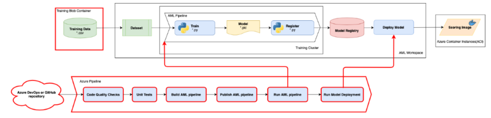

# Azure-MLOps Template Hub for Manufacturing

**ML development lifecycle**


**DevOps for Machine Learning (MLOps)**



[Azure ML services](https://azure.microsoft.com/en-us/services/machine-learning/) and [Azure MLOps](https://azure.microsoft.com/en-us/services/machine-learning/mlops/) provide solutions of ML/AL lifecycle. And **[MLOpsPython](https://github.com/microsoft/MLOpsPython)** is a template of code and pipeline definitions for a Azure machine learning project that shows how to automate an end to end ML/AI workflow.

## Why Azure-MLOps Template Hub for Manufacturing
Nowadays we're seeing lots of shared, different MLOps solutions/templates based on MLOpsPython. However, these shared solutions/templates cannot be easily found and re-used. This is because:
* MLOps solutions 'install' (deployment) processes and documents are complicated
* There's no a well-categorized list of MLOps solution templates
* There's no efficient way to organize various MLOps solution templates

In this hub, you will be able to find:
* A [CLI](https://github.com/MFG-Azure-MLOps-Hub/CLI) tool which can help you quickly deploy [MLOpsPython](https://github.com/microsoft/MLOpsPython) and other listed MLOps templates.
* Lists of various MLOps templates for different business senarios collected from the manufacture industry. 

Our future plan is to:
* Collaborate with [MLOpsPython](https://github.com/microsoft/MLOpsPython) and ensure the compatiblity of [CLI](https://github.com/MFG-Azure-MLOps-Hub/CLI) tool.
* Collect more manufactry industry MLOps templates for this hub.

## CLI Tool
This hub offers a [CLI](https://github.com/MFG-Azure-MLOps-Hub/CLI) tool to simplify the deployment the template into Azure ML services and Azure DevOps. Here is a **[document in MLOpsPython repository](https://github.com/microsoft/MLOpsPython/blob/master/docs/getting_started.md)** to teach how to create the Azure DevOps project by manual, The [CLI](https://github.com/MFG-Azure-MLOps-Hub/CLI) tool provide a command to build it automatically. see **[CLI readme](https://github.com/MFG-Azure-MLOps-Hub/CLI)**.

```
python hub_install.py  --org_url https://dev.azure.com/your_org 
                        --project_name mlopsproj 
                         --source_repo_url https://github.com/MFG-Azure-MLOps-Hub/MLOpsImgClass.git
```

## Templates
As a hub to provide templates for industrial solution, the templates are orginized in multiple layers and templates can reused as **base template** to make the template can focus on AI/ML algorithmn, data and business scenario.

#### Root Template
The Root Template is **[MLOpsPython](https://github.com/microsoft/MLOpsPython)**. All the templates in this hub are extended from it.

#### Algorithmn Templates
* [Image Classification](https://github.com/MFG-Azure-MLOps-Hub/MLOpsImgClass) - TensorFlow & Keras
* [Object Detection](https://github.com/MFG-Azure-MLOps-Hub/MLOpsObjectDetection_ssd_resnet50_v1_fpn) - TensorFlow Object Dection API 
* [Classification/Regression](https://github.com/MFG-Azure-MLOps-Hub/MLOpsPython) - SKLearn
* Classification/Regression - XGBoost [TODO]


#### Industrial Templates [TODO]
* Quality assurance - Printed circuit board 
* Safety - Helmet Detection
* ...

## References

- [Azure Machine Learning (Azure ML) Service Workspace](https://docs.microsoft.com/en-us/azure/machine-learning/service/overview-what-is-azure-ml)
- [Azure ML CLI](https://docs.microsoft.com/en-us/azure/machine-learning/service/reference-azure-machine-learning-cli)
- [Azure ML Samples](https://docs.microsoft.com/en-us/azure/machine-learning/service/samples-notebooks)
- [Azure ML Python SDK Quickstart](https://docs.microsoft.com/en-us/azure/machine-learning/service/quickstart-create-workspace-with-python)
- [Azure DevOps](https://docs.microsoft.com/en-us/azure/devops/?view=vsts)
